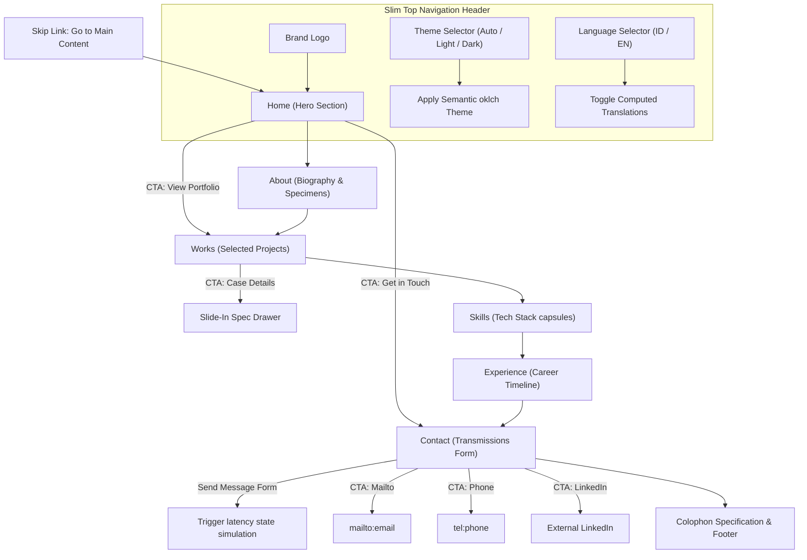

# Flow and Layout Overview — Kinetic Grid Shift & Liquid Glassmorphism

This document provides a technical flow and layout map of the personal portfolio website. The entire experience is delivered as a single-page interactive glassmorphic layout divided into six distinct responsive sections.

## 1. Interaction and Navigation Flow

The portfolio utilizes focus-managed anchor navigation. When clicking a navigation link, the browser scrolls to the section via Lenis and dynamically moves standard keyboard focus to the first heading in the target section, ensuring excellent accessibility for screen readers.



## 2. Layout Structure and Responsive Recomposition

On viewport size mutations, the sections re-arrange dynamically from a complex multi-column grid layout (desktop) into a stacked reading format (mobile).

### Page Composition Map

```
+-------------------------------------------------------+
|  Farid Eka Aprilian    [Home] [About] [Works]   [EN]  | <-- Slim Header
+-------------------------------------------------------+
|                                                       |
|   FARID EKA                                +-------+  |
|   APRILIAN                                 |  / \  |  | <-- Home (Hero):
|   Crafting interfaces that are alive       | ( * ) |  |     (asymmetric poster +
|   [View Portfolio]  [Get in Touch]         |  \ /  |  |      rotating vector target)
|                                            +-------+  |
+-------------------------------------------------------+
|                                                       |
|   ABOUT: DESIGNING DIGITAL PRODUCTS WITH INTENT       | <-- About: Biography and Italic quote
|                                                       |
+-------------------------------------------------------+
|                                                       |
|   WORKS: SELECTED PROJECTS (2x2 Grid Matrix)          | <-- Works Grid: Frosted glass cards
|   +-----------------------+ +-----------------------+ |     with animated slide-in case
|   | Project A (01)        | | Project B (02)        | |     drawers
|   +-----------------------+ +-----------------------+ |
|   | Project C (03)        | | Project D (04)        | |
|   +-----------------------+ +-----------------------+ |
+-------------------------------------------------------+
|                                                       |
|   SKILLS: TECHNICAL & CREATIVE STACK                  | <-- Skills: Glowing glass capsules
|   [ HTML ] [ CSS ] [ Javascript ] [ Vue ] [ Tailwind ] |
|                                                       |
+-------------------------------------------------------+
|                                                       |
|   EXPERIENCE: PROFESSIONAL TIMELINE                   | <-- Experience: Vertical chronological
|   o-- [ UI/UX Designer & Developer ]                  |     chronology timeline
|   o-- [ Frontend Engineer ]                           |
+-------------------------------------------------------+
|                                                       |
|   CONTACT: TRANSMISSIONS DESK & FORM                  | <-- Contact form and active
|                                                       |     social/transmissions links
+-------------------------------------------------------+
|                                                       |
|   COLOPHON SPECIFICATION & FOOTER                     | <-- Technical specifications colophon
+-------------------------------------------------------+
```
